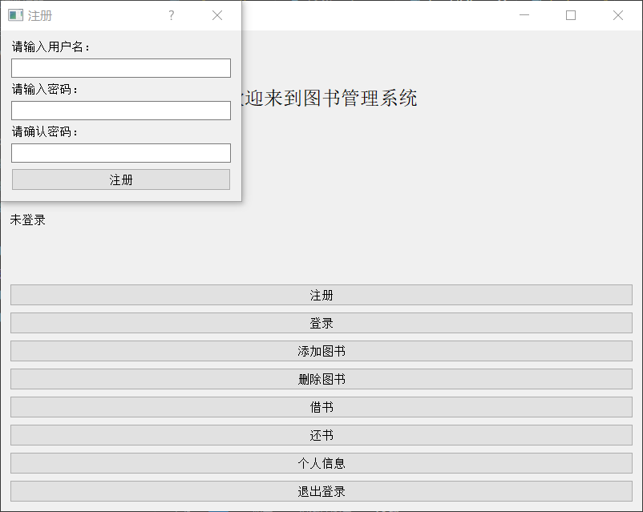
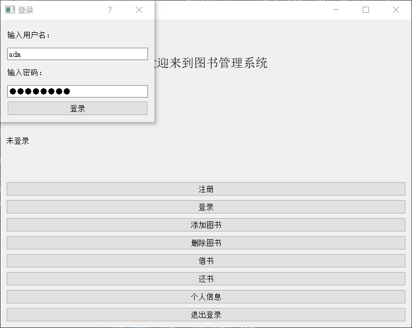
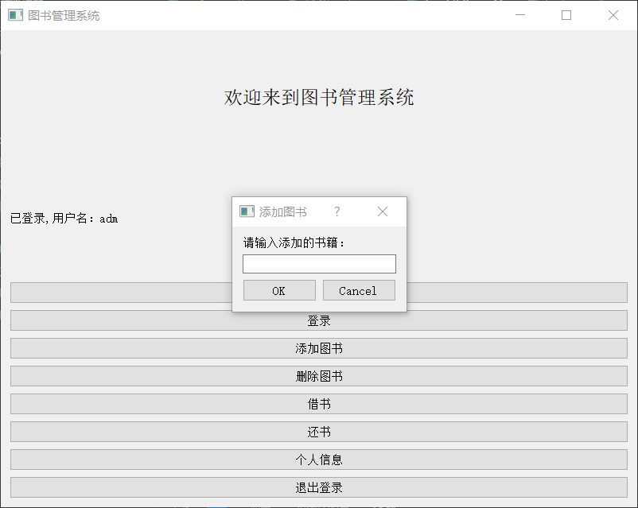
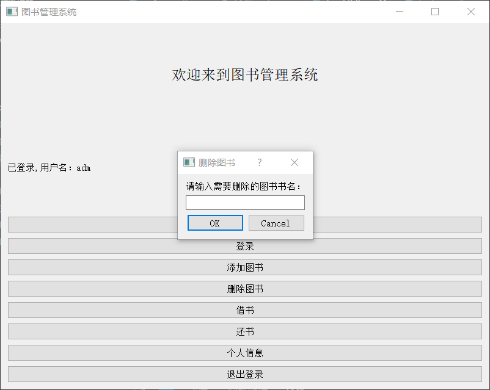
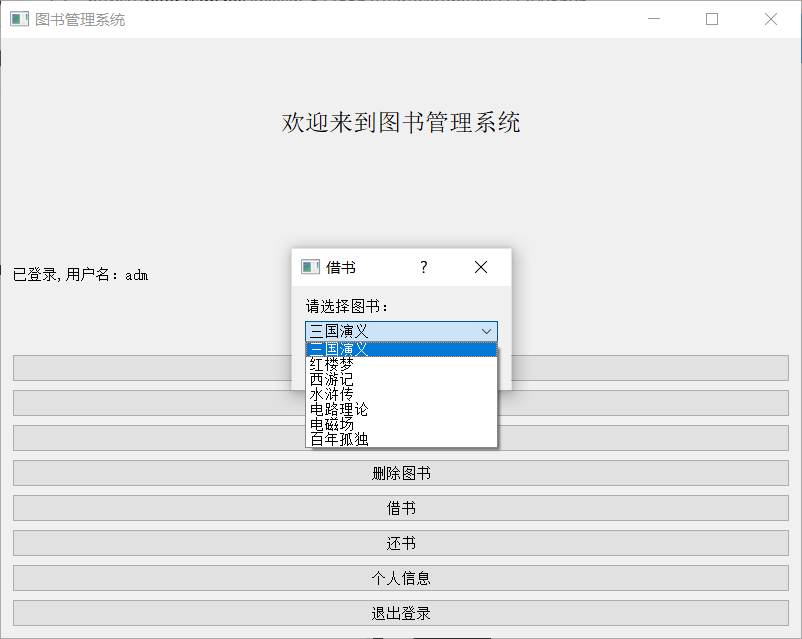
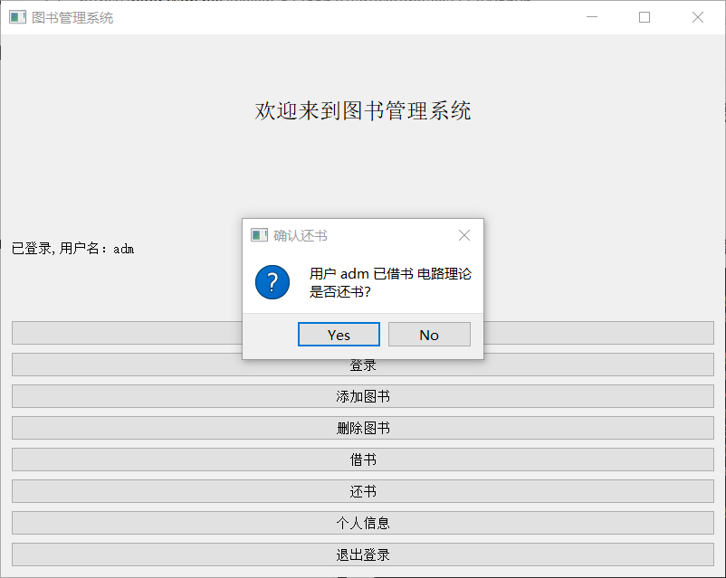
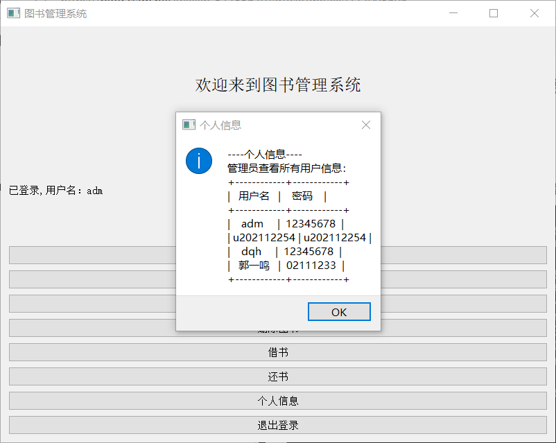

## 项目名称：图书管理系统（Library Management System）

### 1. 项目概述

这个项目是一个用于管理图书馆中图书借阅、归还以及用户注册和登录的简单图书管理系统。通过使用PyQt5构建图形用户界面，并与MySQL数据库交互，实现了基本的图书管理功能。

### 2. 开始使用

#### 2.1 依赖项

- vscode:代码编辑器。
- Python 3.x：确保已经安装了Python的最新版本。
- PyQt5：用于创建GUI界面。
- pymysql：用于与MySQL数据库进行交互。
- prettytable：用于生成美观的文本表格。
- mysql:进行数据管理。

#### 2.2 安装流程

1. 安装anaconda
2. 安装vscode
3. 在vscode上配置python3
4. 创建并激活一个虚拟环境
5. 安装所需依赖库
在命令行中运行以下命令来安装所需的Python库：
```
pip install PyQt5 pymysql prettytable
```

### 3. 运行测试

要运行测试，请执行以下步骤：

1. 打开**命令行终端**或**命令提示符**。
2. 导航到包含项目文件的目录。
3. 运行以下命令以启动图书管理系统：

```
python book_system.py
```

系统将打开一个GUI窗口，您可以通过点击按钮来测试各项功能。

### 4. 使用说明

图书管理系统具备以下功能：
- **用户注册**：通过注册窗口创建新用户账户，输入用户名和密码，并确认密码以完成注册。

- **用户登录**：通过登录窗口输入已有账户的用户名和密码，登录后即可使用其他功能。

- **添加图书**：管理员登录后，可以在系统中添加新的图书信息。

- **删除图书**：管理员登录后，可以删除系统中已存在的图书。

- **借书**：登录用户可以借阅图书，系统将记录用户的借书信息。

- **还书**：登录用户可以归还已借阅的图书。

- **查看个人信息**：登录用户可以查看个人信息，包括已借图书、用户信息
和修改密码。

- **退出登录**：用户可以退出当前登录状态。

### 5. 贡献者

**感谢您考虑为本项目贡献代码！如果您希望参与贡献，可以按照以下步骤进行：**

1. 克隆项目的代码库到本地。
2. 创建一个新的分支，以便进行修改。
3. 进行您的更改和改进。
4. 提交您的更改到项目的主分支。
5. 创建一个拉取请求，描述您的更改和改进。
6. 请确保您的代码符合项目的编码风格和贡献指南。我们将评审您的请求并及时给予回复。

### 6. 版本迭代

项目的版本迭代过程按照以下原则进行：

- Py版本：基于控制台交互的初步逻辑框架。
```python
name_='adm'
#注册
def register():
    print("欢迎来到图书管理系统注册页面")
    username = input("请输入用户名：")
    password_ = input("请输入密码：")
    if len(password_) < 8:
        print("密码不能少于8位")
        register()
    else:
        rpassword = input("请确认密码：")
        if password_ == rpassword:
            print("注册成功！")
            ……
```
- Mql版本：增加数据库连接管理数据。
```python
class LibraryManagementSystem:
    def __init__(self):
        self.name = 'adm'
        self.db = pymysql.connect(host='localhost',
                                  user='root',
                                  password='123456',
                                  database='TESTDB')
        self.cursor = self.db.cursor()
    ……
```
- Pyqt版本：添加可视化的GUI交互。
```python
class LibraryManagementSystem(QMainWindow):
    def __init__(self):
        super().__init__()

        self.name = 'adm'
        self.logged_in = False  # 添加登录状态变量

        self.db = pymysql.connect(host='localhost',
                                  user='root',
                                  password='123456',
                                  database='TESTDB')
        self.cursor = self.db.cursor()

        self.init_ui()

    def init_ui(self):
        self.setWindowTitle('图书管理系统')
        self.setGeometry(100, 100, 800, 600)

        # 创建主窗口中心部件
        self.central_widget = QWidget()
        self.setCentralWidget(self.central_widget)
        ……
```

### 7. 作者

组名：*带我飞* 
作者：*电气2102班 董启翰 u202112254*

### 8. 许可协议

该项目的代码遵循开源许可协议，您可以在项目的源代码中找到许可证信息。

### 9. 致谢

- 感谢PyQt5、pymysql和prettytable等开源库，为项目的开发提供了便利。
- 感谢开发者社区和论坛，提供了宝贵的帮助。
- 感谢同组组员对我提供的支持。
- 感谢您使用此演示项目，希望能对您了解Python GUI开发和数据库操作有所帮助。
---